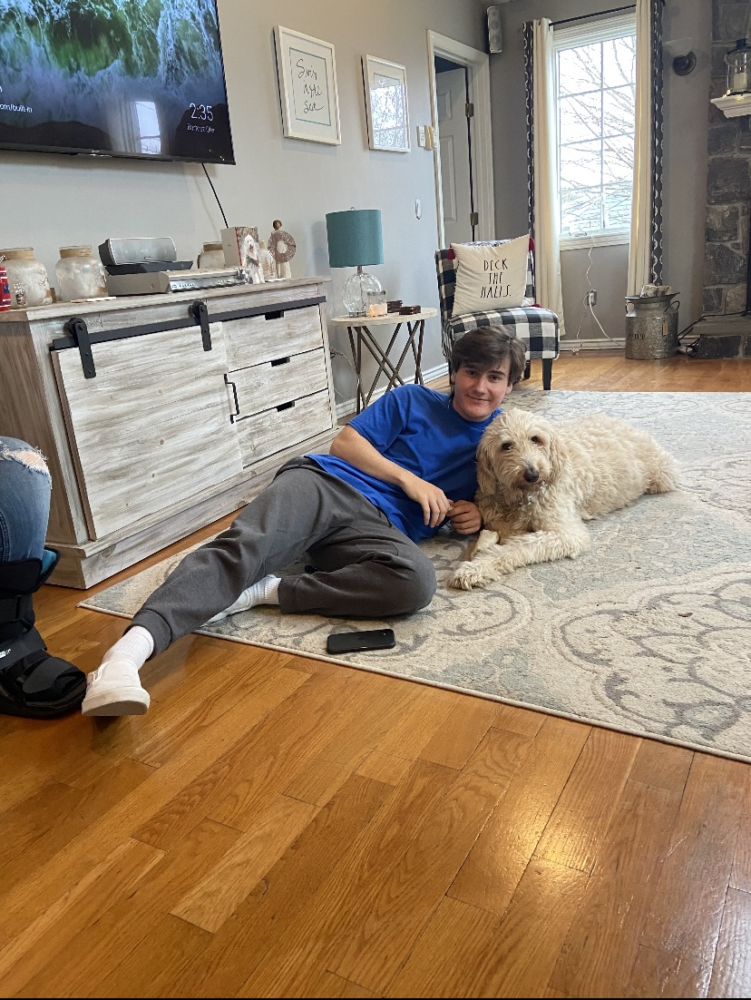
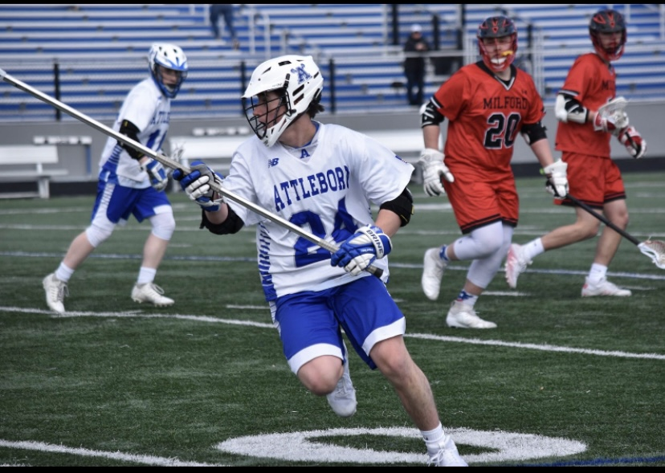

[Home](./)

# About me
 
## General
My name is Jack Handy and I am a 19 year old attending Quinnipiac University. I am from Attleboro Massachusetts which is about 40 minutes outside of Boston.
 
### Schooling and Comp. Sci.
I am currently enrolled at Quinnipiac University in Connecticut working towards my degree in Computer Science. I first began programming in my senior year of high school where I took AP Computer Science. Since then, I have been programming frequently however, I do not have any solo projects that I have done that were not for school. I enjoy Computer Science because it requires more logical thinking than almost any other field. I love the idea of sitting at a computer and giving it the instructions to create something tangible. So far, my second semester has been challenging in terms of work load but I have been keeping up with it and there is a light at the end of the tunnel. My brother mainly got me into Computer Science. He is a software engineer and would show me his super complex projects and they were fascinating to me.
 
### Interests
Although Computer Science takes up the majority of my time, I have a lot of other interests and hobbies to keep me busy. I have been lifting weights for a few years now and I go to the gym at least 5 times a week. I use the gym to get my mind off of things but also because I like to work on myself a lot. Another one of my hobbies/interests is golf. I have been playing golf since I was about 12 years old and I played all throughout high school. I have been to multiple state championships and there is nowhere I would rather be than a golf course in the summer. Lastly, I really enjoy hanging out with friends and family. Whether it's swimming in the pool, skiing, or hanging by the fire, it's my favorite thing to do.
 
## Images

