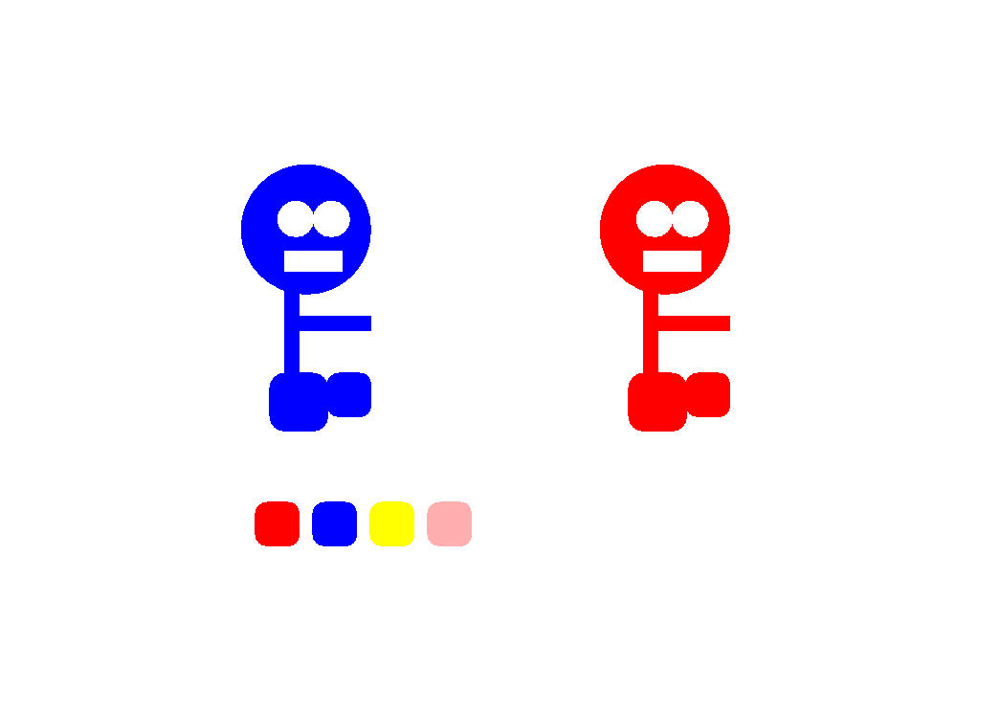

# **My projects ** :raised_hands:
 
### Project: Object-Oriented Cartoon :eyes:
In this project, I created two instances of a cartoon and allow the user to drag and change the color of the cartoon's. The user can drag the body and it will separate from the head, or they can drag the head and it will bring the body along with it regardless of where the body has been dragged to. There is also a button panel with four different color options below the cartoon's. The user can click on a color button and then click on a body part and the color will change. I am proud of this project because it is perhaps the most complex object-oriented program I have done yet.
Click [here](https://github.com/JHandy24/Practice4SER.git) to visit the repo for this project.

